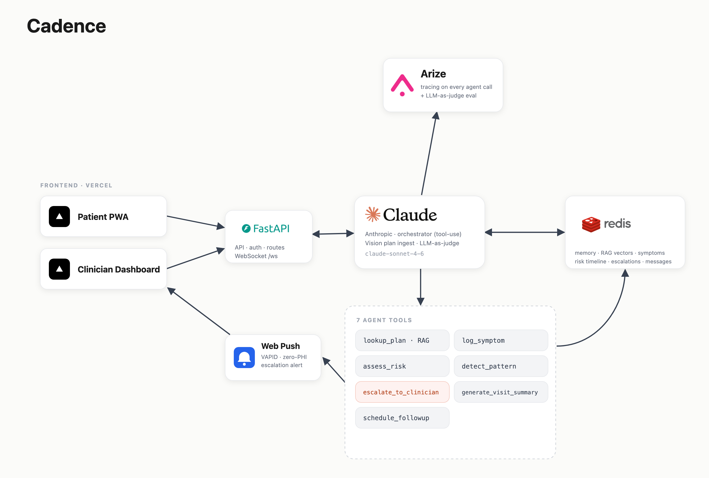

# Cadence

**A proactive AI health companion for high-risk pregnancy — and the OB who cares for her.**

Cadence turns any OB care plan into a daily AI companion for the patient and a full-picture
briefing tool for the clinician. It lives in the silent 7–14 day gap between prenatal
appointments — where dangerous symptoms (rising blood pressure, recurring headaches, sudden
swelling) build undetected — catching problems early, never causing panic, and handing the
doctor a complete, traceable story before the conversation even starts.

---

## System Overview

Cadence is **two experiences sharing one engine**. A warm, mobile-first **Patient PWA** runs a
daily conversational check-in grounded in the patient's specific care plan; a clean
**Clinician Dashboard** ranks a whole panel by risk, surfaces between-visit trends, and receives
real-time escalations. Both talk to a single **FastAPI** backend that drives an **Anthropic
Claude** orchestrator.

Every patient message flows through Claude's tool-use loop: the agent logs structured symptoms,
runs RAG over the patient's own care document, assesses risk against the condition pack's red
flags, detects multi-day patterns, and — when thresholds are crossed — generates a structured
clinical summary, writes it to Redis, fires a zero-PHI Web Push to the clinician, and kicks off
an independent **Arize** LLM-as-judge evaluation of whether that escalation was appropriate.
Nothing is a black box: every agent decision is traced and every escalation is independently
scored.

The engine is condition-agnostic. What changes per condition is a JSON **condition pack** (the
demo runs preeclampsia risk); the orchestration, memory, and dashboard never change.

## Tech Stack



## How Cadence Works

```
OB care plan ─(Claude Vision)─► structured ProtocolJSON ─► Redis (plan + RAG vectors)
        │
Patient opens PWA ─► POST /api/chat/message
        │
Claude orchestrator (claude-sonnet-4-6, tool-use loop):
   lookup_plan ── RAG over the patient's care doc (grounded answers only)
   log_symptom ── structured check-in → Redis time-series
   assess_risk ── current readings vs. red flags → ok | monitor | escalate
   detect_pattern ─ trends over history ("BP up 4 days", "headaches 3 of 9")
   escalate_to_clinician ─► escalations:{id} + Web Push + Arize judge
   generate_visit_summary ─ patient + clinician pre-visit briefs
   schedule_followup ── clinician "book sooner" adjusts the next check-in
        │
Clinician Dashboard ─► panel (risk-ranked) · patient detail (timeline + patterns +
   briefing) · live escalation inbox over WebSocket · one-click actions
        │
Every turn + tool call ─► Arize span (de-identified) · every escalation ─► LLM-as-judge score
```

---

## Sponsors & How We Use Them

### 🟠 Anthropic Claude — the engine

Claude (`claude-sonnet-4-6`) is the core intelligence of Cadence, used in four distinct ways:

- **Agent orchestrator (tool-use loop).** `backend/agent/orchestrator.py` runs a streaming
  tool-use loop where Claude decides which of seven tools to call on each patient turn. The
  orchestrator injects `patient_id` **server-side on every dispatch** — the model never chooses
  whose data it touches, so cross-patient access is architecturally impossible.
- **Vision plan ingestion.** An uploaded OB care plan (PDF/image) is read by Claude Vision and
  parsed into a Pydantic-validated `ProtocolJSON` (goals, meds, tasks, check-in cadence, red
  flags). This is what makes Cadence work for *any* care plan, not a hardcoded protocol.
- **RAG-grounded conversation.** The `lookup_plan` tool does semantic search over the patient's
  own care document; Claude's answers are always traceable to that document — it never gives
  general medical advice it invented, and never diagnoses.
- **LLM-as-judge safety layer.** After every escalation, a **second independent Claude call**
  evaluates "was this escalation appropriate given the symptoms and the care plan's red flags?"
  and returns a confidence score — the auditable safety check behind every human handoff.

### 🔴 Redis — memory, RAG, and real-time state

Redis is the entire "between-visit continuity" layer — the thing that lets Cadence remember,
reason over time, and react instantly. It runs over **TLS (`rediss://`) with authentication**,
and **every key is namespaced by `patient_id`** so queries are always scoped to one patient.

- **Per-patient memory & time-series:** `plan:{id}` (parsed protocol), `session:{id}:{sid}`
  (chat turns), `symptoms:{id}` (structured check-in history), `risk_timeline:{id}` (every risk
  score + rationale).
- **RAG vector store:** `vector:{id}` holds embeddings of the care-plan chunks that power
  `lookup_plan`, so the agent's answers stay grounded in the patient's document.
- **Pattern detection:** `detect_pattern` runs trend logic directly over the `symptoms:{id}`
  time-series (rising BP across days, recurring symptom mentions).
- **Real-time escalation bus:** writes to `escalations:{id}` publish over Redis pub/sub, which
  drives the clinician's live WebSocket inbox — a new escalation appears the instant it happens.
- **In-house clinician↔patient messaging:** `messages:{id}` (clinician → patient), plus
  `notes:{id}`, `followup:{id}`, and `push_subscriptions:{clinician}` — all in Redis, no third
  party.

### 🟣 Arize — the trust & observability layer

Arize is Cadence's proof that the AI is safe and explainable — the beat that answers every
clinical judge's hardest question.

- **Tracing on every agent call.** `setup_tracing()` + an `agent_span()` context manager wrap
  every orchestrator turn and every tool dispatch (`backend/eval/arize_judge.py`,
  `backend/agent/orchestrator.py`).
- **De-identification before egress.** Span attributes are de-identified before they leave our
  infrastructure: `patient_id` is hashed to a `patient_token` and raw symptom text is stripped —
  Arize sees `{ patient_token, tool_called, severity, escalation_appropriate }`, never PHI.
- **LLM-as-judge eval logged to Arize.** `judge_escalation()` posts the appropriateness verdict
  and confidence to the Arize `cadence` project (verified live returning **"appropriate: YES
  (0.97)"**), giving an auditable record that each escalation was independently evaluated.

### Supporting infrastructure

- **Web Push API** — Clinician escalation alerts use the Web Push Protocol (VAPID +
  `pywebpush`, service worker in `public/sw.js`). The payload contains **zero PHI** ("a patient
  needs your attention — tap to review"); the clinician taps into their authenticated dashboard
  to see the clinical detail. No SMS, no carrier network.
- **Vercel** — Both apps ship as separate Vercel projects from one repo: the **Patient PWA**
  (installable, mobile-first) and the **Clinician Dashboard** (desktop), each pointed at the
  deployed backend via `VITE_API_URL`.

---

## Architecture

**Backend (`backend/`)** — FastAPI. Claude tool-use orchestrator (`agent/orchestrator.py`),
seven frozen tools (`agent/tools.py`), Vision plan ingestion (`ingestion/pipeline.py`), Redis
memory + RAG (`memory/`), risk engine + pattern detection (`risk/`), escalation handler
(`escalation/`), Web Push (`notifications/push.py`), Arize tracing + judge (`eval/`). Every tool
returns a Pydantic model from the frozen schema; the data shapes *are* the contract.

**Frontend** — Two TanStack Start (Vite + Nitro) apps: `part-1` (Patient PWA) and `part-2`
(Clinician Dashboard), both React + Tailwind, deployed on Vercel.

## Security & Compliance

Built compliance-first, even with synthetic demo data: **100% synthetic patients** (no real
PHI), Redis over TLS with per-patient key scoping (cross-patient leakage is architecturally
impossible), JWT-in-HttpOnly-cookie auth scaffolding with server-side role enforcement,
de-identified Arize traces, and zero-PHI Web Push payloads. In production, LLM inference moves to
Amazon Bedrock (HIPAA BAA), with BAAs across every covered entity and processor.

---

## Status

Core end-to-end loop is built and verified live: plan ingestion → daily chat check-in → risk
triage → escalation → clinician dashboard, with Arize tracing and the LLM-as-judge eval. The
demo condition pack is preeclampsia risk; a `DEMO_MODE` golden path makes the 90-second demo
deterministic with cached fallbacks for every live AI call.
