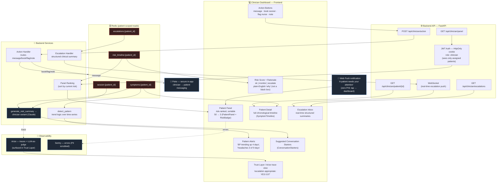
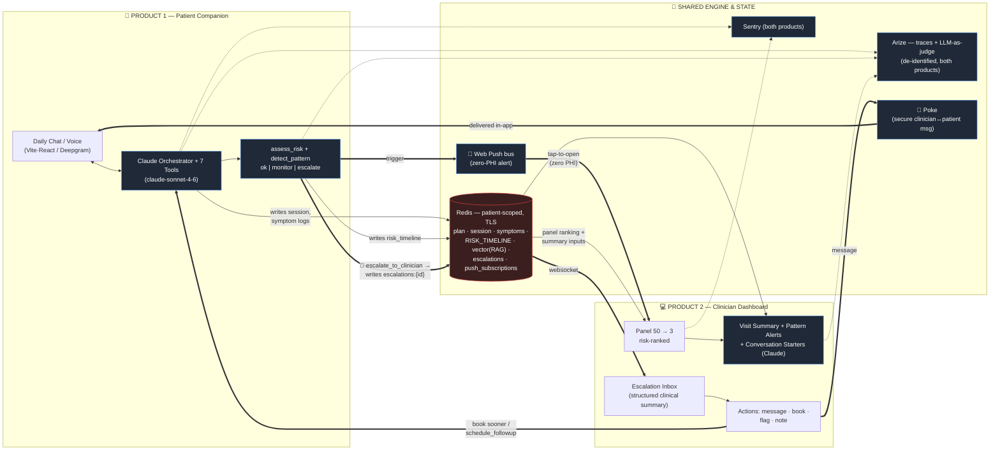

# Cadence — System Diagrams

> Three detailed system diagrams derived from `CLAUDE.md` (the full project guide).
> **Product 1** = Patient Companion (patient-facing). **Product 2** = Clinician Dashboard (OB/MFM-facing).
> **Diagram 3** = how the two products connect through the one shared AI engine.
>
> **Domain:** high-risk pregnancy monitoring — primary condition pack is **preeclampsia risk**.
>
> **Sponsor stack** annotated inline: **Anthropic Claude** (orchestrator `claude-sonnet-4-6` + vision ingest) ·
> **Redis** (memory + symptom logs + risk timeline + RAG vectors) · **Arize** (tracing + LLM-as-judge eval) ·
> **Deepgram** (voice — bonus) · **Web Push API** (escalation alert, zero PHI) · **Poke** (secure clinician↔patient
> messaging) · **Sentry** (error monitoring) · **BrowserBase** (optional portal plan pull).
>
> Rendered with Mermaid (GitHub / VS Code / any Mermaid viewer).
>
> **Note on stack:** CLAUDE.md documents a Next.js frontend + FastAPI backend. The code currently scaffolded in
> this repo is **Vite + React + TanStack Router** (Lovable). These diagrams reflect the *documented target
> architecture*; the patient routes (`/`, `/watchfor`, `/history`, `/summary`) already exist in `src/routes`.

---

## Diagram 1 — Product 1: Patient Companion

The warm, non-clinical daily check-in app. The whole point: catch problems early, never cause panic, always
hand the OB a clean story. Built around a single daily chat; everything else is secondary.

```mermaid
flowchart TB
    subgraph PT["📱 Patient Companion — Frontend (mobile-first, warm UI)"]
        CHAT["Daily Chat Check-in<br/>conversational, never alarm-y<br/>(ChatBubble)"]
        WATCH["'Things to Watch For' Card<br/>red_flags in plain English<br/>(WatchForCard)"]
        HIST["Symptom History / Timeline<br/>'14 check-ins, no red flags'<br/>(SymptomTimeline)"]
        SUMM["'Take to Your Appointment'<br/>auto visit summary<br/>(VisitSummaryCard)"]
        FLAG["One-tap Flag<br/>'I want my OB to know'<br/>(patient controls flag,<br/>agent decides urgency)"]
        BANNER["Gentle Alert Banner<br/>'Sent to Dr. Reyes'<br/>(AlertBanner)"]
        VOICE["📞 Voice Check-in<br/>Deepgram (bonus + recorded fallback)"]
    end

    subgraph API["⚙️ Backend API — FastAPI"]
        CHATEP["POST /api/chat/message"]
        INGEP["POST /api/ingest"]
        AUTH["JWT Auth<br/>HttpOnly Secure cookie<br/>role: patient"]
    end

    subgraph INGEST["📥 Plan Ingestion Pipeline"]
        UPLOAD["OB uploads care plan<br/>(PDF / image)"]
        VISION["Claude Vision<br/>(Anthropic)"]
        PROTO["ProtocolJSON<br/>{ goals, meds[], tasks[],<br/>check_in_cadence, red_flags[],<br/>patient_context }<br/>Pydantic-validated"]
        BROWSER["BrowserBase<br/>(optional portal pull)"]
    end

    subgraph ENGINE["🤖 Agent Engine — Claude Orchestrator (claude-sonnet-4-6, tool use)"]
        SYS["System prompt + condition pack<br/>+ tone + guardrails<br/>(no diagnosis, RAG-grounded)"]
        subgraph TOOLS["Agent Tools"]
            T1["lookup_plan (RAG)"]
            T2["log_symptom"]
            T3["assess_risk"]
            T4["detect_pattern"]
            T5["escalate_to_clinician"]
            T6["generate_visit_summary"]
            T7["schedule_followup"]
        end
    end

    subgraph PACK["🧩 Condition Pack (config)"]
        PRE["preeclampsia_risk.json<br/>daily_questions, red_flags[],<br/>tone, coaching_topics"]
    end

    subgraph REDIS["🗄️ Redis (rediss:// TLS, auth, patient-scoped keys)"]
        K1["plan:{patient_id}"]
        K2["session:{patient_id}:{session_id}"]
        K3["symptoms:{patient_id}"]
        K4["risk_timeline:{patient_id}"]
        K5["vector:{patient_id}  (RAG embeddings)"]
        K6["escalations:{patient_id}"]
    end

    subgraph OBS["🔭 Observability"]
        ARIZE["Arize — trace every decision<br/>(de-identified) + LLM-as-judge"]
        SENTRY["Sentry — errors<br/>(PII scrubbing on)"]
    end

    PUSH["🔔 Web Push → clinician<br/>(handoff out — see Diagram 3)"]

    %% Ingestion
    UPLOAD --> INGEP --> VISION --> PROTO
    BROWSER -.-> VISION
    PROTO --> K1
    PROTO --> K5
    PACK --> PROTO

    %% Patient ↔ engine
    CHAT <--> CHATEP
    VOICE <--> CHATEP
    CHATEP --> AUTH --> ENGINE
    PACK --> SYS
    ENGINE --> TOOLS

    %% Tool wiring
    T1 --> K5
    T2 --> K3
    T3 --> K4
    T4 --> K3
    T6 --> SUMM
    T6 --> K3
    T7 --> CHATEP
    ENGINE <--> K2

    %% Patient surfaces fed from data
    K3 --> HIST
    PACK --> WATCH
    FLAG --> CHATEP

    %% Escalation out
    T5 --> K6
    T5 --> PUSH
    T5 --> BANNER

    %% Observability taps
    ENGINE -.trace.-> ARIZE
    T3 -.trace.-> ARIZE
    ENGINE -.errors.-> SENTRY

    classDef sponsor fill:#1f2937,stroke:#60a5fa,color:#fff;
    classDef redis fill:#3b1f1f,stroke:#ef4444,color:#fff;
    class VISION,ENGINE,SYS,ARIZE,SENTRY,VOICE,BROWSER,PUSH sponsor;
    class K1,K2,K3,K4,K5,K6 redis;
```

**Sponsor map (Product 1):** Anthropic (vision ingest + orchestrator + all 7 tools) · Redis (plan, session,
symptoms, risk timeline, RAG vectors, escalations) · Deepgram (voice bonus) · Arize (traces + judge) ·
Sentry (errors) · Web Push (escalation out) · BrowserBase (optional ingest).

---

## Diagram 2 — Product 2: Clinician Dashboard

The pre-visit briefing tool for the OB/MFM. Not a data firehose — a ranked, explained, time-respecting view.
The promise: **50 patients → the 3 that matter today**, each with a full story before the conversation starts.

**Sponsor map (Product 2):** Anthropic (clinician visit summary) · Redis (reads symptoms, risk timeline,
escalations, session) · Poke (Message action button) · Web Push (escalation intake, zero PHI) ·
Arize (trust layer / audit view) · Sentry (errors).

---

## Diagram 3 — How Product 1 and Product 2 Connect

One engine, two experiences. A patient interaction flows ingest → engage → triage → escalate, then **hands off**
to the OB; the OB's action (message / book) loops back to the patient. Every demo beat ends the same way:
*the agent catches something and hands a human a clean, traceable handoff.* **Triage and escalate — never diagnose.
Human-in-the-loop always visible.**

### The handoff loop (the whole product in one line)
1. **Product 1** engages the patient daily; `assess_risk` / `detect_pattern` evaluate against the pack's `red_flags[]`.
2. On a red flag, `escalate_to_clinician` writes `escalations:{patient_id}` to **Redis** and triggers a **Web Push**
   (zero PHI) — the clinician taps and lands on the dashboard inside their authenticated session.
3. **Product 2** ranks the panel from `risk_timeline` (50 → 3) and generates the clinician visit summary +
   pattern alerts + conversation starters.
4. The clinician takes a **one-click action**: *message* (via **Poke**, in-app, no SMS) or *book sooner*
   (`schedule_followup` back into Product 1's orchestrator).
5. **Arize** traces every decision across both products; the **LLM-as-judge** eval proves it *escalated
   appropriately* — the auditable safety layer shown in the Trust Layer view.

---

## Component → Sponsor quick reference

| Component | Product(s) | Sponsor |
|---|---|---|
| Vision plan ingestion · orchestrator (`claude-sonnet-4-6`) · risk · visit summaries | 1 & 2 | **Anthropic Claude** |
| Voice check-in (+ recorded fallback) | 1 | **Deepgram** |
| Plan, session, symptoms, risk timeline, RAG vectors, escalations, push subs | 1 & 2 (shared) | **Redis** |
| Decision tracing + LLM-as-judge safety eval + Trust Layer / audit view | 1 & 2 | **Arize** |
| Escalation alert to clinician browser (zero PHI in payload) | 1 → 2 | **Web Push API** |
| Secure in-app clinician → patient messaging ("Message" button) | 2 → 1 | **Poke** |
| Error monitoring (PII scrubbing) | 1 & 2 | **Sentry** |
| Optional: pull a care plan from a patient portal | 1 (ingest) | **BrowserBase** |

> **Guardrails reflected in all diagrams:** no diagnosis (collect → triage → escalate only); RAG-grounded answers;
> human-in-the-loop always visible; synthetic patients / no real PHI in demo; JWT in HttpOnly cookies; Redis over
> TLS with patient-scoped keys; de-identified Arize traces; PII-scrubbed Sentry. Production: Amazon Bedrock for
> LLM inference + BAAs with every covered entity and processor.
